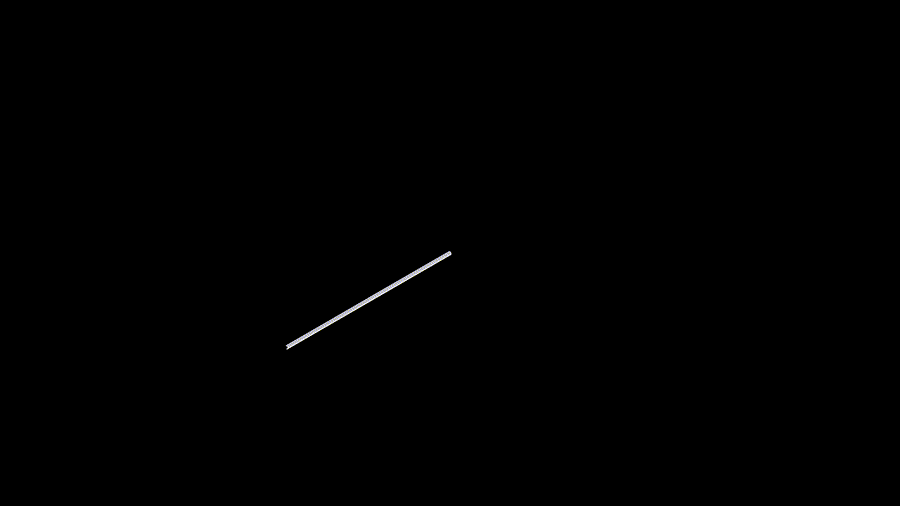

<h1 align="center">Unified Spherical Frontend:<br>Learning Rotation-Equivariant Representations of<br>Spherical Images from Any Camera</h1>

<p align="center">
  <a href="https://cvpr.thecvf.com/Conferences/2026"></a>
  <a href="https://tomnotch.com/USF"></a>
  <a href="https://arxiv.org/abs/2511.18174"></a>
  <a href="https://github.com/Tom-Notch/USF/actions/workflows/pre-commit.yml"></a>
  <a href="https://github.com/Tom-Notch/USF/actions/workflows/test.yml"></a>
</p>

<p align="center">
  <a href="https://tomnotch.com">Mukai (Tom Notch) Yu</a>&emsp;
  <a href="https://mosamdabhi.github.io">Mosam Dabhi</a>&emsp;
  <a href="https://liuyuexie.github.io">Liuyue (Louise) Xie</a>&emsp;
  <a href="https://theairlab.org/team/sebastian">Sebastian Scherer</a>&emsp;
  <a href="https://www.laszlojeni.com">L&aacute;szl&oacute; A. Jeni</a>
</p>

<p align="center">
  Carnegie Mellon University, Robotics Institute
</p>

<p align="center">
  
</p>

Unified Spherical Frontend (USF) is a distortion-free lens-agnostic rotation-equivariant vision framework for modern perception

## Usage

- Configure environment variables

  ```Shell
  cp .env.example .env
  ```

  Edit `.env` and fill in your own values (WandB API key, entity, Docker username, etc.). This file is gitignored and will not be committed. It is automatically loaded into `os.environ` when you `import usf`, so Hydra configs can reference them via `${oc.env:VAR}`.

- Docker available by `docker compose up -d` if you set `DOCKER_USER=tomnotch` in `.env`

  - [scripts/](scripts/) contains scripts to build/push/pull/run Docker/Singularity

- Set up the environment locally (optional)

  1. Environment compartmentalization

     1. Install [Conda](https://www.anaconda.com/download/success)/[Miniconda](https://www.anaconda.com/docs/getting-started/miniconda/main)/[Mamba](https://mamba.readthedocs.io/en/latest/installation/mamba-installation.html)

     1. Create the conda environment (provides Python 3.12, uv, and system-level libraries):

        ```Shell
        conda env create -f environment.yml
        ```

     1. Activate environment:

        ```Shell
        conda activate usf
        ```

     1. Install Python packages with uv:

        ```Shell
        uv pip install -e .            # core deps
        uv pip install -e '.[full]'    # optional deps (jupyter, pre-commit, etc.)
        ```

        Optional Manim for `notebook/manim/`: not part of `[full]` (PyPI needs native Cairo/Pango). See the note in `requirements-full.txt`, then `uv pip install manim` when those libraries are available on the host.

     1. Verify: `pip check` and `python -c "import torch, torch_scatter, xformers, faiss"`

        - If `torch_scatter` complains about `GLIBC` version mismatch, build from source:

          ```Shell
          uv pip install --no-build-isolation --no-deps "git+https://github.com/rusty1s/pytorch_scatter.git@2.1.2"
          ```

- Download datasets, create `data/` folder and symlink everything under it

  ```Shell
  ln -s path/to/your/dataset/folder/* data/
  ```

  <details>
  <summary>Click to see folder structure</summary>

  ```Shell
  ❯ tree -dhl ./data
  ./data
  ├── [  28]  MNIST -> /home/your_user_name/dataset/MNIST
  │   ├── [4.0K]  t10k-images-idx3-ubyte
  │   ├── [4.0K]  t10k-labels-idx1-ubyte
  │   ├── [4.0K]  train-images-idx3-ubyte
  │   └── [4.0K]  train-labels-idx1-ubyte
  ├── [  30]  PANDORA -> /home/your_user_name/dataset/PANDORA
  │   ├── [4.0K]  annotations
  │   └── [ 92K]  images
  └── [  36]  stanford2D3DS -> /home/your_user_name/dataset/stanford2D3DS
      └── [4.0K]  area_3
          ├── [4.0K]  3d
          │   └── [ 12K]  rgb_textures
          ├── [4.0K]  data
          │   ├── [448K]  depth
          │   ├── [460K]  global_xyz
          │   ├── [464K]  normal
          │   ├── [460K]  pose
          │   ├── [436K]  rgb
          │   ├── [472K]  semantic
          │   └── [484K]  semantic_pretty
          ├── [4.0K]  pano
          │   ├── [ 16K]  depth
          │   ├── [ 16K]  global_xyz
          │   ├── [ 20K]  normal
          │   ├── [ 16K]  pose
          │   ├── [ 16K]  rgb
          │   ├── [ 16K]  semantic
          │   └── [ 20K]  semantic_pretty
          └── [376K]  raw
  ```

  </details>

  - You may change this however you like, but you need to modify corresponding YAML configs in `config/` folder

  - Link to relevant dataset:

    1. [MNIST](https://www.kaggle.com/datasets/hojjatk/mnist-dataset)
    1. [PANDORA](https://drive.google.com/file/d/1JAGReczN_h3F3mY-mlGTVSeDx-CCJigC/view)
    1. [2D3DS](https://cvg-data.inf.ethz.ch/2d3ds/)
       - [semantic_labels.json](https://raw.githubusercontent.com/alexsax/2D-3D-Semantics/refs/heads/master/assets/semantic_labels.json)

- As an example, run notebooks such as [sampler.ipynb](notebook/visualization/sampler.ipynb) and [network_layers.ipynb](notebook/visualization/network_layers.ipynb)

- To train MNIST classification model, just do this in your shell

  ```Shell
  train task=mnist
  ```

  - You might need to follow the instruction to create or login to your WanDB account and set up a project using WanDB's web interface for the logging to work properly, otherwise, you can run [mnist.ipynb](notebook/mnist/mnist.ipynb) for a local demo
  - Relevant config file: [mnist.yaml](config/task/mnist.yaml)

- To train object detection

  ```Shell
  train task=object_detection
  ```

  - Local demo: [object_detection.ipynb](notebook/object_detection/object_detection.ipynb)

  - Relevant config file: [object_detection.yaml](config/task/object_detection.yaml)

- To train semantic segmentation

  ```Shell
  train task=semantic_segmentation
  ```

  - Local demo: [semantic_segmentation.ipynb](notebook/semantic_segmentation/semantic_segmentation.ipynb)
  - Relevant config file: [semantic_segmentation.yaml](config/task/semantic_segmentation.yaml)

- To visualize a (batch of) spherical image file

  ```Shell
  visualize_spherical_image -p path/to/image.npz -f desired_fps -s point_size
  ```

  - Path can be relative, e.g. I do `-p data/output.npz` all the time
  - FPS and point size are optional
  - You should see an interactive Open3D visualization window, press `h` to see operations printed in shell

- To generate lens normal map for a given camera, make sure you have the camera config YAML file ready, see [rgb_0.yaml](config/wildfire/subcanopy/sensors/rgb_0.yaml) for example. Then run the following command

  ```Shell
  generate_lens_normal_map -c your/camera/config.yaml
  ```

  This will generate a lens normal map `.npz` and `.pdf` in the `lens_normal_map` folder under the same folder of your camera config file.

- For coordinate system conventions, read [Spherical & Vector Convention.pdf](docs/Spherical%20&%20Vector%20Convention.pdf)

## Development Environment Setup

- Run [scripts/dev_setup.sh](scripts/dev_setup.sh)

## Citation

If you find this work useful, please cite:

```bibtex
@inproceedings{yu2026usf,
  title     = {Unified Spherical Frontend: Learning Rotation-Equivariant Representations of Spherical Images from Any Camera},
  author    = {Yu, Mukai and Dabhi, Mosam and Xie, Liuyue and Scherer, Sebastian and Jeni, L{\'a}szl{\'o} A.},
  year      = {2026},
  month     = jun,
  booktitle = {IEEE/CVF Conference on Computer Vision and Pattern Recognition (CVPR)},
  publisher = IEEE
}
```
